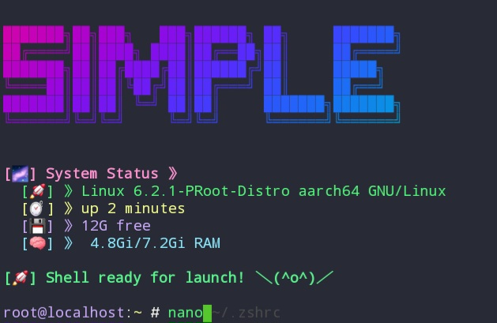

# Ultimate ZSH Configuration



## Features ✨

- 🎨 Beautiful colored interface
- ⚡ Optimized for speed
- 🤖 Automatic dependency installation
- 🧩 Plugin management
- 🖥️ System information display

## Installation

1. Clone the repository:✨
   ```bash
   git clone https://github.com/futuretonight/Ubuntu-Terminal.git
   ```

2. Navigate into the repository:↪️
   ```bash
   cd Ubuntu-Terminal
   ```

3. Run the install script:🟢
   ```bash
   bash install.sh
   ```

4. Restart your terminal or run:🔑
   ```bash
   source ~/.zshrc
   ```

## Customization🔮

Add your personal aliases in `~/.zsh_aliases`

## Post-Clone Welcome Banner

To enable the post-clone banner:
- Git hooks will be automatically installed during setup.
- If you want to enable them manually, run:
  ```bash
  cp .githooks/post-checkout .git/hooks/post-checkout
  chmod +x .git/hooks/post-checkout
  ```

Enjoy your customized terminal experience!

## License 🪪 
MIT
